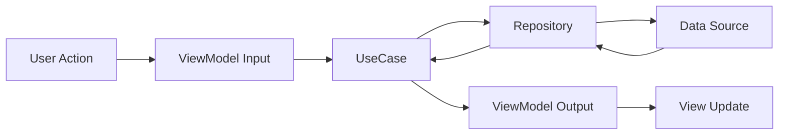

# 두섭이 (Do-Surf)

<p align="center">
  
</p>

<p align="center">
  <strong>초보 서퍼를 위한 해양 차트 및 서핑 기록 관리 앱</strong>
</p>

<p align="center">
  <a href="https://apps.apple.com/kr/app/두섭이/id6753593506">
    
  </a>
</p>

<p align="center">
  
  
  
</p>

---

## 📱 스크린샷

<p align="center">
  
  
  
  
</p>

> 왼쪽부터: 대시보드, 해양 차트, 기록하기, 기록 조회

---

## 🌊 프로젝트 소개

두섭이는 초보 서퍼가 복잡한 해양 차트를 읽기 어려워한다는 문제를 해결하기 위해 만들어진 앱입니다.

### 주요 기능
- **실시간 해양 차트**: 파고, 풍향, 수온 등 서핑에 필요한 기상 정보를 한눈에 확인
- **서핑 기록 관리**: 시작/종료 시간, 평가, 메모를 기록하고 차트 데이터와 연동
- **통계 대시보드**: 선호하는 조건, 최근 기록, 고정 차트를 카드 형태로 제공
- **스마트 필터링**: 날짜, 해변, 평점별로 기록을 필터링하고 조회

### 해결하고자 한 문제
- 초보 서퍼가 WindFinder 등의 복잡한 차트를 이해하기 어려움
- 어떤 조건에서 서핑이 좋았는지 기억하기 어려움
- 개인 기록 기반으로 최적의 서핑 조건을 찾기 힘듦

---

## 🛠 기술 스택

### iOS
- **Language**: Swift 5.0
- **UI**: UIKit, SnapKit
- **Architecture**: MVVM + Input-Output Pattern, Clean Architecture
- **Reactive**: RxSwift, RxCocoa
- **Database**: CoreData (Local), Firebase Firestore (Sync)
- **Network**: Alamofire
- **Others**: Charts, Design System

### Backend
- **Platform**: Firebase
- **Functions**: Python Cloud Functions
- **Database**: Firestore
- **API**: Open-Meteo Marine Weather API

> 🔗 **백엔드 레포지토리**: [DoSurf-Backend](https://github.com/piriram/do-surf-functions)

---

## 🏗 아키텍처

<p align="center">
  
</p>

### MVVM + Clean Architecture

```
├── Presentation Layer
│   ├── ViewControllers
│   ├── ViewModels (Input-Output)
│   └── Views (Custom Components)
│
├── Domain Layer
│   ├── Entities
│   ├── UseCases
│   └── Repository Interfaces
│
└── Data Layer
    ├── Repositories (Implementation)
    ├── Network (API Services)
    └── Local (CoreData, Firestore)
```

### 데이터 흐름



---

## 💡 핵심 기술 결정

### 1. RxSwift를 선택한 이유

**문제 상황**
- Firebase 실시간 데이터 변경, 사용자 필터링 액션, UI 업데이트를 동시에 처리
- 복잡한 비동기 처리를 콜백 체인으로 관리하면 가독성 저하

**해결 방법**
```swift
// Input
let beachSelected = beachDropdown.rx.tap
    .withLatestFrom(selectedBeach)
    .asObservable()

// Transform
input.beachSelected
    .flatMapLatest { [weak self] beach in
        self?.chartRepository.fetchCharts(beachID: beach.id) ?? .empty()
    }
    .asDriver(onErrorJustReturn: [])
    .drive(onNext: { [weak self] charts in
        self?.updateUI(with: charts)
    })
    .disposed(by: disposeBag)
```

**효과**
- 선언적 코드로 데이터 흐름을 명확하게 표현
- flatMapLatest로 불필요한 API 호출 방지
- DisposeBag으로 메모리 누수 방지

---

### 2. Firebase + Python Functions를 선택한 이유

**문제 상황**
- 해양 데이터를 6시간마다 자동으로 수집하고 모든 사용자에게 실시간 동기화 필요
- iOS 앱에서 백그라운드 작업으로는 안정적인 데이터 수집 불가능

**해결 방법**

<p align="center">
  
</p>

```python
# Firebase Scheduled Functions
@scheduler_fn.on_schedule(schedule="every 6 hours")
def fetch_marine_data(event):
    beaches = get_all_beaches()
    
    for beach in beaches:
        data = fetch_openmeteo_api(beach.lat, beach.lon)
        processed_data = process_marine_data(data)
        
        # Firestore 업데이트
        db.collection('regions').document(beach.region_id)\
          .collection('beaches').document(beach.id)\
          .collection('forecasts').add(processed_data)
```

**효과**
- 서버리스로 서버 관리 부담 제거
- 실시간 Snapshot Listener로 앱 내 자동 업데이트
- Python의 데이터 처리 라이브러리 활용

---

### 3. Clean Architecture + DI를 선택한 이유

**문제 상황**
- ViewModel에서 직접 Firebase를 호출하면 테스트 불가능
- 기능 추가 시 기존 코드 수정 범위가 넓어짐

**해결 방법**
```swift
// Domain Layer - Protocol
protocol ChartRepository {
    func fetchCharts(beachID: String) -> Observable<[Chart]>
}

// Data Layer - Implementation
class DefaultChartRepository: ChartRepository {
    private let firebaseService: FirebaseService
    
    init(firebaseService: FirebaseService) {
        self.firebaseService = firebaseService
    }
    
    func fetchCharts(beachID: String) -> Observable<[Chart]> {
        return firebaseService.observeCharts(at: "beaches/\(beachID)/forecasts")
    }
}

// Presentation Layer - DI
class ChartViewModel {
    private let chartRepository: ChartRepository
    
    init(chartRepository: ChartRepository) {
        self.chartRepository = chartRepository
    }
}

// Test
class MockChartRepository: ChartRepository {
    func fetchCharts(beachID: String) -> Observable<[Chart]> {
        return .just([Chart.mock()])
    }
}
```

**효과**
- Mock 객체로 ViewModel 단위 테스트 가능
- Repository 구현체만 교체하면 데이터 소스 변경 가능
- 각 레이어의 독립성 확보

---

## 🎨 Design System

<p align="center">
  
</p>

### Typography & Color
```swift
enum Typography {
    static let title = UIFont.systemFont(ofSize: 20, weight: .bold)
    static let body = UIFont.systemFont(ofSize: 16, weight: .regular)
    static let caption = UIFont.systemFont(ofSize: 14, weight: .regular)
}

enum ColorSystem {
    static let primary = UIColor(hex: "#007AFF")
    static let background = UIColor(hex: "#F2F2F7")
    static let cardBackground = UIColor(hex: "#E8F2FF")
}
```

### Custom Components
- `StatCardView`: 통계 카드
- `ChartTableViewCell`: 차트 데이터 셀
- `SurfRatingCardView`: 서핑 평가 카드

---

## 📊 프로젝트 구조

```
DoSurf-iOS/
├── Application/
│   ├── AppDelegate.swift
│   └── SceneDelegate.swift
│
├── Presentation/
│   ├── Dashboard/
│   │   ├── DashboardViewController.swift
│   │   ├── DashboardViewModel.swift
│   │   └── Views/
│   ├── Chart/
│   ├── Record/
│   └── History/
│
├── Domain/
│   ├── Entities/
│   │   ├── Beach.swift
│   │   ├── Chart.swift
│   │   └── SurfRecord.swift
│   ├── UseCases/
│   └── Repositories/
│
├── Data/
│   ├── Repositories/
│   ├── Network/
│   │   ├── FirebaseService.swift
│   │   └── APIService.swift
│   └── Local/
│       └── CoreDataManager.swift
│
└── Resources/
    ├── DesignSystem/
    └── Assets/
```

