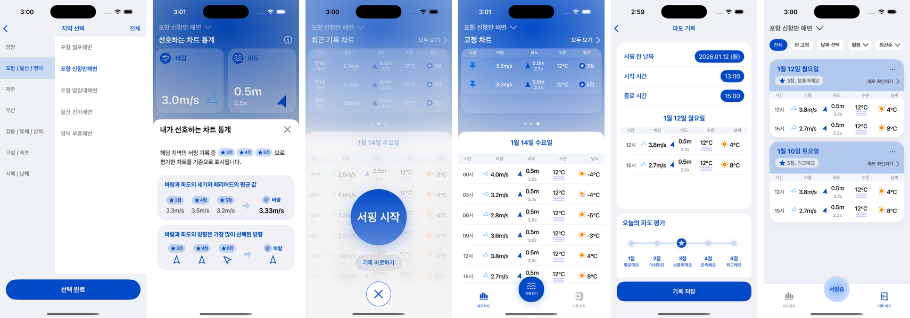

# 두섭이 (DoSurf)

  
   
   
  <b>두섭이(DoSurf)</b>는 서핑 가능 여부를 차트 대신 <b>직관적 UI</b>와 <b>개인화 조건</b>으로 보여주는 iOS 앱입니다.
   
   
  Surf Smart, Surf Happy.

  
  
  
  
  

  

## 프로젝트 개요

초보 서퍼가 복잡한 기상 데이터를 해석하지 않고도 서핑 조건을 바로 확인하고, 서핑 기록을 체계적으로 관리할 수 있도록 돕는 앱입니다.
파도, 바람, 수온 데이터를 시각화된 차트로 제공하고, Apple Watch 연동과 Live Activity로 세션 중에도 실시간 상태를 확인할 수 있습니다.

- **핵심 기간**: 2025.04 - 2025.06
- **역할**: iOS 개발 및 서버 개발
- **배포 타겟**: iOS 16.2+, watchOS 9.6+
- **GitHub**: [DoSurf-iOS](https://github.com/piriram/DoSurf-iOS)
- **Backend**: [DoSurf-Backend](https://github.com/piriram/DoSurf-API)
- **App Store**: [다운로드](https://apps.apple.com/kr/app/%EB%91%90%EC%84%AD%EC%9D%B4-%EB%82%98%EB%A7%8C%EC%9D%98-%EC%84%9C%ED%95%91-%EC%B0%A8%ED%8A%B8%EB%A5%BC-%EA%B8%B0%EB%A1%9D%ED%95%B4%EC%9A%94/id6753593506)

## 주요 기능

- 🌊 **해양 예보 차트** - 해변별 파도, 바람, 수온을 3시간 단위로 시각화
- 🏄 **서핑 기록 관리** - 시작/종료 플로우 또는 바로하기로 간편 기록
- ⌚ **Apple Watch 연동** - 심박, 칼로리, 스트로크 수 실시간 수집
- 📱 **Live Activity** - 잠금화면과 Dynamic Island에서 세션 상태 즉시 확인
- 📊 **통계 카드** - 최근 기록, 고정 기록, 해변 기준 파도/바람 분석

## 기술 스택

| 분류 | 기술 |
|------|------|
| UI / Presentation | UIKit, SnapKit, SwiftUI (Widget), ActivityKit |
| Architecture | MVVM, Clean Architecture, Repository Pattern |
| Reactive & State | RxSwift |
| Data Layer | Firestore, CoreData, WatchConnectivity |
| Testing | XCTest |

## 핵심 구현

### 1. Watch-iPhone 양방향 동기화 충돌 해결

타임스탬프 기반 `최신 우선 병합 + 삭제 전파` 전략으로 오프라인 동시 수정 시에도 데이터 손실 없는 양방향 동기화를 구현했다.
증분 업데이트로 메시지 크기 `70%` 감소, 배치 전송으로 전송 횟수 `60%` 감소.

`WatchConnectivity` `Tombstone` `증분 업데이트` `충돌 해결`

---

### 2. LRU 캐시 + Prefetch 기반 차트 조회 성능 개선

지역 연속 조회 시 반복되는 Firestore 요청을 NSCache 기반 LRU 캐시와 인접 지역 예측 prefetch로 최적화했다.
차트 표시 시간 `1.2초 -> 0.3초`, Firestore 읽기 요청 `50%` 감소, 월 비용 `35%` 절감.

`NSCache` `Prefetch` `Stale-While-Revalidate` `ChartCacheManager`

---

### 3. Live Activity + Dynamic Island 실시간 세션 모니터링

잠금화면과 Dynamic Island에서 앱 오픈 없이 세션 상태를 확인할 수 있도록 ActivityKit 기반 실시간 모니터링을 구현했다.
세션 경과에 따라 갱신 주기를 `1분 -> 5분 -> 10분`으로 조절해 배터리 수명 약 `25%` 연장.

`ActivityKit` `Live Activities` `Dynamic Island` `딥링크`

---

### 4. 목업 데이터 기반 개발 전략

기상청 API 중단 상황에서 프로토콜 기반 추상화로 비즈니스 로직이 데이터 소스를 인지하지 않게 설계했다.
API 복구 후 코드 수정 없이 데이터 소스 전환이 가능해 일정 지연을 회피했다.

`Protocol 추상화` `의존성 주입` `Firestore 목업` `DTO Optional`

## 개발자

|  |
|:---:|
| [Piri(김소람)](https://github.com/piriram) |
| iOS 개발 |

## License

MIT License
